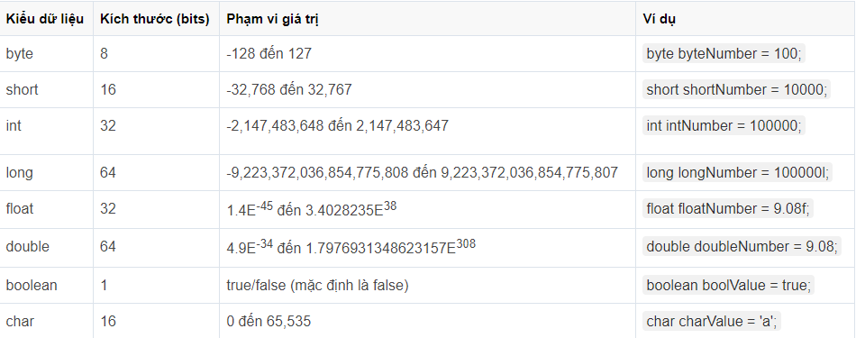

I.Các kiểu dữ liệ trong Java
1.Kiểu dữ liệu : 
*Kiểu dữ liệu cơ sở : dùng để lưu trữ 1 giá trị đơn

*Kiểu Wrapper class : là kiểu dữ liệu vừa lưu trữ giá trị đơn vừa có 1 số các phương thức đi kèm
2.Ép kiểu
*Ép kiểu rộng/Ép kiểu không tường minh
- byte -> short -> int -> long -> float -> double
=> Dùng để chuyển kiểu dữ liệu từ vùng lưu trữ nhỏ lên vùng lưu trữ lớn (Không làm mất mát dữ liệu)
*Ép kiểu hẹp /Ép kiểu tường minh
- double -> float -> long -> int -> short -> byte
=> Dùng để chuyển kiểu dữ liệu từ vùng lưu trữ lớn xuống vùng lưu trữ nhỏ (Làm mát dữ liệu)